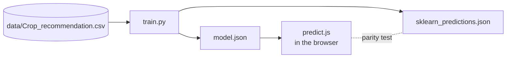

# AgriApp

Suggests a crop from seven soil and weather readings, entirely in your browser.

[](https://github.com/Dakuaisu/Agriculturewebsite/actions/workflows/ci.yml)
[](https://github.com/Dakuaisu/Agriculturewebsite/actions/workflows/pages.yml)
[](https://dakuaisu.github.io/Agriculturewebsite/)
[](LICENSE)

**Live demo:** https://dakuaisu.github.io/Agriculturewebsite/


<sub>The form after entering a sample reading. The model recommends rice.</sub>

## What it does

You enter nitrogen, phosphorus, potassium, temperature, humidity, soil pH and rainfall. AgriApp suggests
one of 22 crops. It's a static React site, and the model runs in the page.

- **Runs entirely in the browser.** A Gaussian naive Bayes model is shipped as a small JSON file.
- **No backend.** No server to host, nothing to wake up, no cold start.
- **Inputs never leave the page.** Predicting makes no network requests.
- **Input validation.** Each value must lie within the range seen in the training data.
- **Exact parity with scikit-learn.** A test checks that the browser returns scikit-learn's label on all
  2,200 dataset rows.

## How it works



`train.py` fits the model with scikit-learn and exports the parameters it uses at predict time. It also
writes scikit-learn's prediction for every row. `predict.js` repeats the same log-probability calculation
in JavaScript, and `predict.test.js` checks that its answers match exactly.

## Tech stack

| Part | Tools |
|---|---|
| Frontend | React 18, React Router 7, Tailwind CSS 4, Vite 8 |
| Model training | Python 3.12, scikit-learn 1.9.1, pandas |
| Checks | Vitest, ESLint, ruff, GitHub Actions |
| Hosting | GitHub Pages |

## Quick start

Run the site locally (Node 22):

```sh
cd AgricultureApp
npm ci
npm run dev            # http://localhost:5173
```

Retrain the model (Python 3.12):

```sh
cd training
python -m venv .venv && source .venv/bin/activate
pip install -r requirements.txt
python train.py
```

Run the checks that CI runs:

```sh
cd training && ruff check . && python train.py && git diff --exit-code -- .
cd AgricultureApp && npm run lint && npm test && npm run build
```

Training is deterministic. CI fails if retraining changes the committed report, ranges, `model.json` or
predictions, or if the JS predictor disagrees with scikit-learn on any row.

## Project structure

```text
AgricultureApp/              React + Vite site
  src/predict.js             naive Bayes prediction in JavaScript
  src/predict.test.js        parity test against scikit-learn
  src/validation.js          input checks using feature_ranges.json
  src/Croprecc.jsx           the form
  src/About.jsx              about page
training/
  train.py                   trains, evaluates and exports the model
  data/                      dataset and its licence notice
  model.json                 parameters used by the browser
  sklearn_predictions.json   scikit-learn's label for every dataset row
  feature_ranges.json        allowed input ranges
  evaluation.md              accuracy, baselines, confusion matrix
.github/workflows/           CI and GitHub Pages deploy
AUDIT.md                     findings from the 2026 cleanup
```

## Model card

- **Data:** [Crop Recommendation Dataset](https://www.kaggle.com/datasets/atharvaingle/crop-recommendation-dataset)
  by Atharva Ingle (Kaggle, Apache 2.0 per its Kaggle metadata). It has 2,200 rows: 22 crops × 100 rows,
  with no missing values or duplicates. Kaggle says it was "built by augmenting" Indian rainfall, climate
  and fertiliser data, without documenting the method, so treat it as partly synthetic. A copy and its
  notice are in [`training/data/`](training/data/NOTICE.md).
- **Method:** scikit-learn `GaussianNB` with default settings, trained on a stratified 80% split with
  seed 42, with no preprocessing. The model is a prior, a mean and a variance per crop and feature (`var`
  already includes sklearn's smoothing term).
- **Why naive Bayes:** simplicity, not accuracy. It makes 2 test errors against 5 for the 10 bagged
  decision trees used before. A gap of a few test errors isn't evidence that it's the better model.
- **Inputs:** N 0–140, P 5–145, K 5–205, temperature 8–44 °C, humidity 14–100 %, pH 3.5–10, rainfall
  20–299 mm. These are the ranges seen in the data, and the form rejects anything outside them.
- **Accuracy:** 99.5% on the 440 held-out rows (438 correct). Both errors are rice predicted as jute.
  5-fold cross-validation gives 99.5% (std 0.2%). Full confusion matrix:
  [`evaluation.md`](training/evaluation.md).
- **Caveat:** on the same split, bagged decision trees score 98.9%, a single decision tree 98.0%, and a
  majority-class baseline 4.5%. A model that treats each crop as one Gaussian blob scoring this high means
  each crop forms a tight, mostly separate cluster. That is consistent with data generated per crop rather
  than collected from real farms.
- **History:** the model originally committed in 2024 was paired with scalers fitted on a single row. As
  deployed, it scored 9.1% on this dataset and only ever answered Orange or Apple (AUDIT.md F02).

## Limitations

- The high accuracy reflects an easy dataset, not a strong model.
- Nothing here has been validated against real fields.
- Don't use it for agronomic decisions.

## Project history

AgriApp started as a 2024 college group project. It was cleaned up in 2026: broken features were removed
and the model was rebuilt and tested, as recorded in [AUDIT.md](AUDIT.md).

## Authors

- Adnan Rashid
- Anushikha Singh
- Utkarsh Dwivedi

## License

The code is released under the [MIT License](LICENSE). The dataset is licensed separately under
Apache 2.0; see [`training/data/NOTICE.md`](training/data/NOTICE.md).
