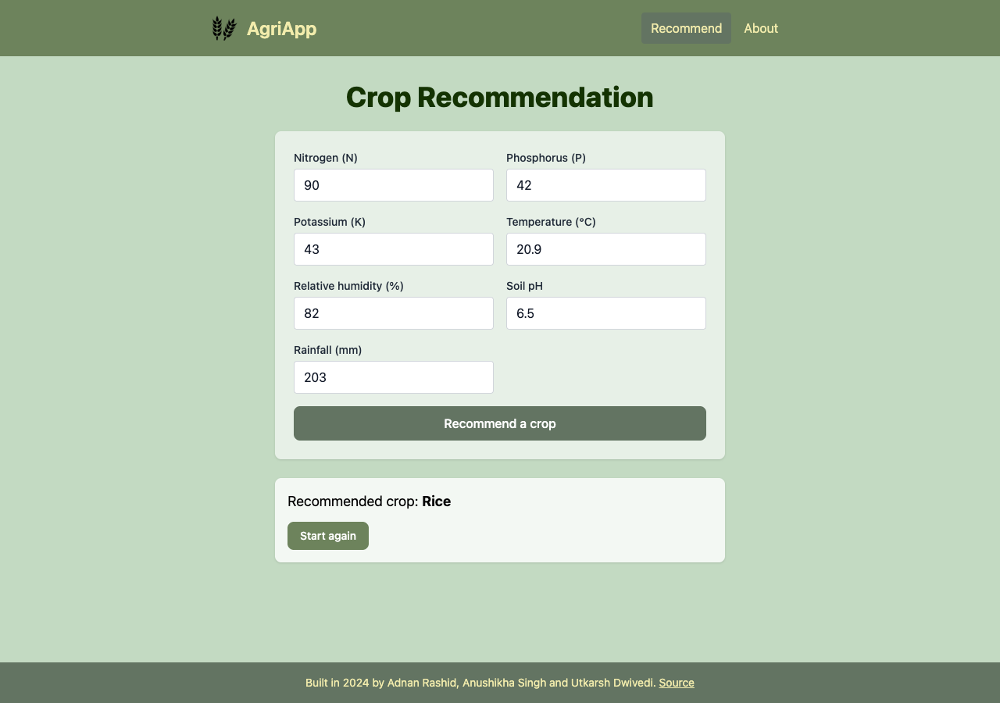

# AgriApp: crop recommendation

You enter seven soil and weather values (nitrogen, phosphorus, potassium, temperature, humidity, soil pH,
rainfall) and AgriApp suggests one of 22 crops. It's a React + Vite frontend talking to a small Flask API
that runs a scikit-learn model.

This was a 2024 college group project. It was cleaned up later: features that never worked (sign-in, a
cultivation roadmap, weather analysis, SMS OTP) were removed rather than finished. See [AUDIT.md](AUDIT.md)
for what was wrong and how each finding was handled.



**Live:** not deployed yet. Once the steps in [Deploy](#deploy) are done, the site will be at
https://dakuaisu.github.io/Agriculturewebsite/. The API runs on Render's free tier, which sleeps when idle,
so the first request after a quiet spell can take up to a minute.

## Run it locally

Backend (Python 3.12):

```sh
cd Backend
python -m venv .venv && source .venv/bin/activate
pip install -r requirements-dev.txt
flask --app app run --port 5001     # macOS uses port 5000 for AirPlay
```

Frontend (Node 22):

```sh
cd AgricultureApp
npm ci
VITE_API_URL=http://localhost:5001 npm run dev
```

Then open http://localhost:5173.

Checks (the same ones CI runs):

```sh
cd Backend && ruff check . && pytest -q
cd AgricultureApp && npm run lint && npm test && npm run build
```

## Retrain the model

```sh
cd Backend && python train.py
```

This rebuilds `model.pkl`, `feature_ranges.json` (the input limits used by the API and the form) and
[`evaluation.md`](Backend/evaluation.md) from `data/Crop_recommendation.csv`. Training is deterministic, and
CI checks that retraining reproduces the committed report.

## API

`POST /predict` with a JSON body:

```json
{"N": 90, "P": 42, "K": 43, "temperature": 20.9, "humidity": 82, "ph": 6.5, "rainfall": 203}
```

returns `{"crop": "rice"}`. Missing, non-numeric or out-of-range values return 400 with per-field
messages, e.g. `{"errors": {"ph": "Must be between 3.5 and 10.0."}}`.

## Model card

- **Data:** [Crop Recommendation Dataset](https://www.kaggle.com/datasets/atharvaingle/crop-recommendation-dataset)
  by Atharva Ingle on Kaggle, Apache 2.0 (as listed in its Kaggle metadata). It has 2,200 rows: 22 crops ×
  100 rows each, with no missing values or duplicates. Kaggle says it was "built by augmenting" Indian
  rainfall, climate and fertiliser data. The augmentation method isn't documented, so treat the data as
  partly synthetic. A copy and its notice are in [`Backend/data/`](Backend/data/NOTICE.md).
- **Method:** scikit-learn `BaggingClassifier` with 10 decision trees (the same model type as the original
  project), trained on a stratified 80% split with seed 42. No feature scaling, since trees don't need it.
- **Inputs:** each value must lie within the range seen in the data (N 0–140, P 5–145, K 5–205,
  temperature 8–44 °C, humidity 14–100 %, pH 3.5–10, rainfall 20–299 mm). Outside those ranges the model
  would be guessing, so the API rejects them.
- **Accuracy:** 98.9% on the 440 held-out rows (435 correct). 5-fold cross-validation gives 99.0%
  (std 0.3%). The 5 errors are rice ↔ jute (3), blackgram → maize and lentil → mothbeans. The full
  confusion matrix is in [`evaluation.md`](Backend/evaluation.md).
- **Caveat:** this score reflects an easy dataset, not a strong model. On the same split, Gaussian naive
  Bayes scores 99.5% and a single decision tree 97.9% (majority-class baseline: 4.5%). Each crop forms a
  tight, mostly separate cluster, which is consistent with the data being generated per crop rather than collected from
  real farms. Nothing here has been validated against real fields; don't use it for agronomic decisions.
- **History:** the model originally committed in 2024 was paired with scalers fitted on a single row. As
  deployed, it scored 9.1% on this dataset and only ever answered Orange or Apple (AUDIT.md F02). It has
  been replaced by the retrained model above.

## Deploy

1. **API (Render):** create a Blueprint from this repo. `render.yaml` defines a free web service in
   `Backend/` that runs `gunicorn app:app` and allows CORS from `https://dakuaisu.github.io`.
2. **Frontend (GitHub Pages):** in the repo settings, set Pages → Source to "GitHub Actions". Add a
   repository variable `API_URL` set to the Render service URL. Pushing to `main` then builds and deploys
   the site.

## Authors

- Adnan Rashid
- Anushikha Singh
- Utkarsh Dwivedi
